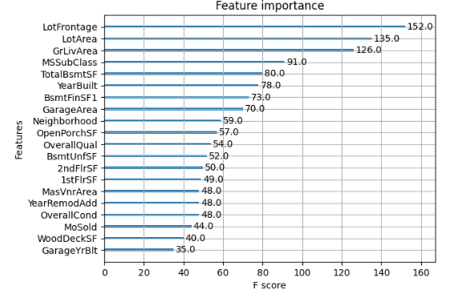

# Ames Iowa Home Price Prediction
### Presented by Lauren McKay
## Introduction
For my modeling project, I have decided to participate in this Kaggle competition; https://www.kaggle.com/competitions/house-prices-advanced-regression-techniques 

Predicting home values is a critical skill for real estate investors, buidlers, and prospective home sellers and buyers. Traditional methods of forecasting propertly values like comparative market anaylsis and apprasials are labor intensive, requiring expert judgement and potentially occupying critical time. These traditional ways to forecast are also slow to adapt to current market trends and can be subjective. With the rise of advanced data modeling, the real estate markets can be more quickly and potentially more effectively predicted. 

 Using data from Ames Iowa generated by the American Statistical Association, I aimed to create an advanced regression model to predict home values in the area with minimal error, identifying the most influential features affecting market price. 
## Methodology
 To address these concerns I decided to create a regression model using a training and testing subset of the available data. I isloated the desired outcome variable, SalePrice, and then dropped ID as it is irrelevant to modeling. Next, I decided to drop a few variables I deemed unimportant such as MiscFeature, as I felt that this variable is hard to quantify as the feature is unknown. After data cleaning, I separated the available data into training features, testing features, and a training target to properly use the train test split function. 

I employed a XGBoost regression model which uses decision trees to correct for errors made in the previous tree. There are several ways to tweak this modeling technique which allow for customizable applications. For example, I used 1000 trees in this data exercise. The model generated through XGBoost was then used to generate the predictions on the test set. 

## Visualization
The graph below illustrates the regression model to visualize the accuracy. The blue dots generally follow the calculated regression line with a few outliers as the price reaches the upper threshold. 
 

The following graph ranks each feature by the affect on the total importance, with lot features ranking at the top. Other important features are as follows; living area square footage, building class, and basement characteristics. 

 

## Conclusion

  Overall my modeling techniques for predicting real estate value of properties were largly successful. The R squared of the model is .91173, and the root mean sqaured error, what it competition is judged in regards to, is .14291. While the predictions using the given data set were generally accurate, there are limitations to the regression. For example, the data set only contains observations from the year 2011, which leads to the fact that the model is largly only relevant for that specific year; maybe one or two years following as well. In order for this regression to have a wider applicabiltiy, more data would need to be tested on to illustrate trends overtime. Furthermore, these data do not include possibly important factors such as school district quality or local industry. Lastly, the data used is only generated from a small town in Iowa, which is thus representative of trends from Ames and perhaps only the surrounding areas. 

While there are limitations to the model, the regression was largly accurate at predicting property values. 
